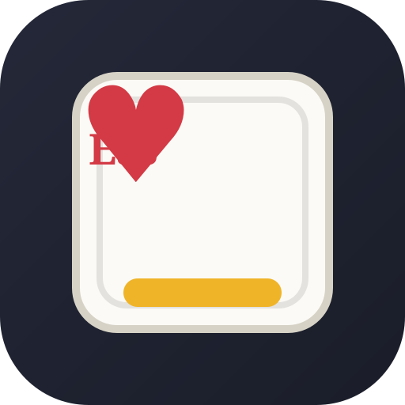

# Trix Card Tracker

Spåra och bocka av spelade kort i **Trix** under pågående spel – med ett enda klick. Inga data skickas någonstans; allt sparas lokalt i webbläsaren.



## Funktioner

- **52 kort i 4 färggrupper** – Hjärter, Ruter, Spader och Klöver (2 till Ess) i pokerstil
- **Ett-klicksavbockning** – spelat kort blir nedtonat och överstruket direkt
- **Live-räknare** – hur många kort som återstår totalt och per färg, med progressbar
- **Varningar & färgstatus** – pulserande röd varning när en färg har ≤3 kort kvar, grön bock när en färg är avklarad
- **Autosave** – leken sparas automatiskt och finns kvar efter stängning
- **Ångra** – knapp eller `Ctrl+Z`
- **Auto-läge (skärmavläsning av Jawaker)** – dela spel-fönstret, rita in stick-området, tryck `F5` efter varje stick så bockas korten av automatiskt (kräver https/localhost)
- **Rike-filter** – kombinera fokus på Hjärter Kung, Damer, Ruter eller Spader
- **Highlights** – guldmarkering av Damer, röd markering av Hjärter Kung och Ruter-kort
- **Ljud & animationer** – klickljud och flipp-animation (avstängningsbart)
- **Installeras som app (PWA)** – egen ikon och offline-stöd

## Kom igång

- **Online:** [mohamadnour19.github.io/trix-card-tracker](https://mohamadnour19.github.io/trix-card-tracker/)
- **Lokalt:** Öppna `index.html` direkt i din webbläsare – allt fungerar utan installation.

### Auto-läge (skärmavläsning av Jawaker)

1. Öppna appen via **https** eller `http://localhost` (skärmdelning blockeras annars).
2. Klicka **"Auto: Av"** och välj Jawaker-fönstret när webbläsaren frågar.
3. Dra en ruta runt stick-området i mitten av bordet (sparas för nästa gång).
4. Efter varje stick: tryck **`F5`** – appen känner igen korten och bokar av dem. Vid osäkerhet frågar den om bekräftelse.

### Installera som Windows-app (PWA)

1. Starta en lokal server i mappen:

   ```
   python -m http.server 8080
   ```

2. Öppna [http://localhost:8080](http://localhost:8080) i Chrome eller Edge.
3. Klicka på *installera*-ikonen i adressfältet (eller `Installera app`-knappen när den visas).

## Genvägar

| Tangent | Funktion |
| --- | --- |
| `Ctrl+Z` | Ångra senaste klick |
| `R` | Återställ alla kort |
| `F5` | Scanna sticket (i auto-läge) |

## Filstruktur

```
index.html            Appen (HTML + CSS + JavaScript)
manifest.webmanifest  PWA-manifest
sw.js                 Service worker (offline-stöd)
icon.svg              App-ikon
```